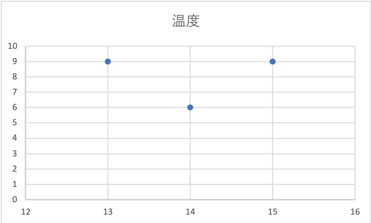

# 第19回レポート
<div style="text-align:center;">3-C-19 Takahito Sueda</div>

## ファイルに書き込んでみよう
日付と温度をLivedoorのAPIから取得し、結果をechoによってdata.txtに入力。
```bash
echo -e "日付\t温度\n13\t9\n14\t6\n15\t9" >> data.txt

```

## 可視化してみよう
先程入力したdata.txtは
```txt
日付	温度
13	9
14	6

```
のようになっているので、exelを用いて可視化した結果を図1に示す。


<div style="text-align:center;">図1 日付と気温の図</div>
