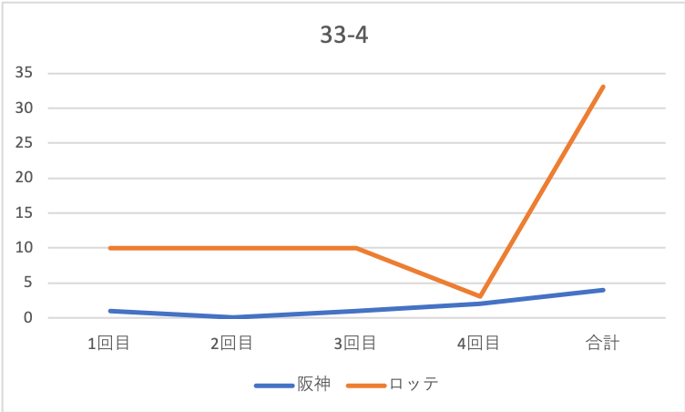

# 計算科学レポート
<div style="text-align:center;">3-C-8 川元 昂祐</div>

## ファイルに書き込む
### プログラム
```python3
# ファイルパス
path = './o.txt'

# 戦歴
data0 = 'チーム\t1回目\t2回目\t3回目\t4回目\t合計'
data1 = '阪神\t1\t0\t1\t2\t4'
data2 = 'ロッテ\t10\t10\t10\t3\t33'

data = data0 + '\n' + data1 + '\n' + data2 + '\n'

# 書き込み
with open(path, mode='w') as f:
    f.write(data)

# 確認
with open(path) as f:
    print(f.read())

```

### 結果
```text
チーム	1回目	2回目	3回目	4回目	合計
阪神	1	0	1	2	4
ロッテ	10	10	10	3	33

```

## 可視化
exelを用いて可視化した結果を図1に示す


<div style="text-align:center;">図1</div>

<div style="text-align:center;" style="font-color:gray;">copyright 2018 Takahito Sueda</div>
